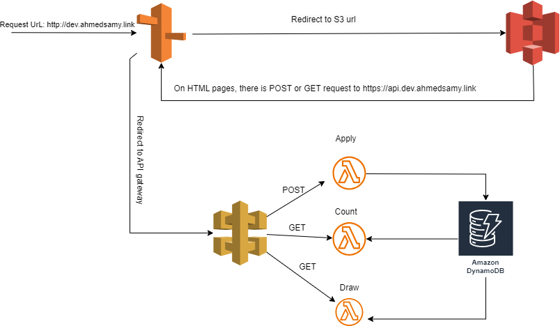
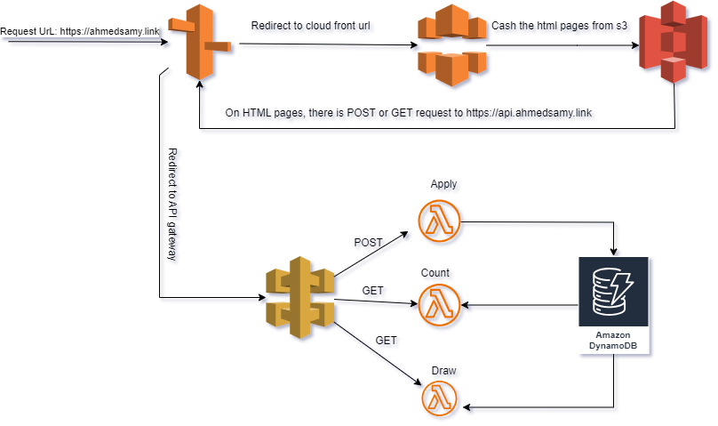

# Serverless Raffle App with Terraform

## Overview

This project is a serverless raffle application built using Terraform, designed to deploy applications with any number of serverless functions. The project supports both development and production environments, which can be managed easily by selecting the appropriate Terraform workspace.

## Features

- **Serverless Infrastructure**: Deploy a fully serverless application using AWS resources.
- **Multiple Functions**: Supports building applications with any number of Lambda functions.
- **Environment Management**: Easily switch between development and production environments by changing the Terraform workspace.
- **Modules for Clean Code**: The project is organized into modules for a cleaner and more maintainable codebase.
- **S3 Web Hosting**: S3 is enabled for web hosting to serve the HTML frontend.
- **CloudFront on Production**: CloudFront is used for the production environment to serve the app globally, but it’s not enabled in the development environment.

## Project Structure

The project is modularized for flexibility and scalability:
- **Terraform Modules**: The infrastructure is organized into reusable modules to keep the code clean and easy to maintain.
- **Workspaces**: Separate environments (development and production) are managed using Terraform workspaces, ensuring isolated configuration changes.
- **Lambda Functions**: The application can include multiple AWS Lambda functions, depending on the requirements.

## Architecture Diagrams

- **Development Environment Architecture**: 
- **Production Environment Architecture**: 

## Setup and Usage

### Steps to Deploy

1. **Clone the Repository**:
   ```bash
   git clone https://github.com/AhmedSamy9821/Serverless_Raffle_App_with_Terraform.git
   cd Serverless_Raffle_App_with_Terraform/main
   ```
   
2. **Input Functions and HTML Pages**: If you're deploying a different application using this project, modify the `terraform.tfvars` file:
   - Input your functions' names and directories.
   - Input your HTML pages' names and directories.
   - Add your custom domain name.
     
3. **Initialize Terraform**:
   Run the following command in the main directory (since the project uses modules):
   ```bash
   terraform init
   ```

4. **Select a Workspace**:
   - For development:
     ```bash
     terraform workspace new dev
     terraform workspace select dev
     ```
   - For production:
     ```bash
     terraform workspace new prod
     terraform workspace select prod
     ```

5. **Apply Terraform Configuration**:
   Apply the configuration to deploy the serverless application:
   ```bash
   terraform apply
   ```

### Additional Details

- **Amazon Certificate Manager (ACM)**: ACM is used to create an SSL certificate for the app’s URL and API URL, ensuring secure communication.
- **CloudFront in Production**: CloudFront is only enabled in the production environment to serve the app globally. In the development environment, CloudFront is not used as the primary goal is to showcase the functionality locally.

## Architecture Overview

- **Development Environment**: The development environment is designed to showcase the app's features without global distribution.
- **Production Environment**: The production environment is globally distributed using CloudFront, ensuring users from any location can access the app efficiently.
